# linux_tutor

***
#### CONTENT:

* [03. The Linux Terminal In Depth](#03-the-linux-terminal-in-depth)
    * [Update upgrade](#update-upgrade)
    * [Open terminal](#open-terminal)
    * [Terminator install](#terminator-install)
    * [Help Linux commands (man)](#help-linux-commands-man)
    * [Command type](#command-type)
    * [Getting help for built-in commands](#getting-help-for-built-in-commands)
    * [Search for a command, function, or keyword in all man pages](#search-for-a-command-function-or-keyword-in-all-man-pages)
    * [Keyboard Shortcuts](#keyboard-shortcuts)
    * [History of commands](#history-of-commands)
    * [View command history from a file](#view-command-history-from-a-file)
    * [View command history from a memory](#view-command-history-from-a-memory)
    * [Start command from history by number](#start-command-from-history-by-number)
    * [Run last command](#run-last-command)
    * [Run 3 from the end command](#run-3-from-the-end-command)
    * [Find (last) and execute command in history by keyword](#find-last-and-execute-command-in-history-by-keyword)
    * [Find (last) and PRINT command in history by keyword](#find-last-and-print-command-in-history-by-keyword)
    * [SEARCH command in history](#search-command-in-history)
    * [Remove command from history](#remove-command-from-history)
    * [Delete all history commands](#delete-all-history-commands)
    * [Execute a command WITHOUT writing to history](#execute-a-command-without-writing-to-history)
    * [History of commands with DATE](#history-of-commands-with-date)
    * [Temporarily get – ROOT](#temporarily-get--root)
    * [Exit ROOT mode](#exit-root-mode)
    * [Temporary ROOT mode](#temporary-root-mode)
    * [Set password for ROOT](#set-password-for-root)

***

# 03. The Linux Terminal In Depth

#### Open terminal:

```
CTRL+ALT+T
```

Bash - это дефолтный shell в linux. Консоль - вид терминала.

#### Terminator install:

```
$ sudo apt update && sudo apt install terminator
```

#### Help Linux commands (man):

```
$ man ls
```

Страница man отображается с помощью - **less**

Шорткарты для навигации:

* h => получить help
* q => выйти
* enter => скролл на 1 линию
* space => скролл на 1 экран
* G => скролл в конец документа
* g => скролл в начало документа
* /string => поиск вперед для string
* ?string => поиск назад для string
* n / N => навигация по найденному вперед / назад

Обзор команды:
ls [OPTION]... [FILE]...

* ... => несколько аргументов, аналог vararg Java
* **[ ]** => скобками обозначены не обязаьельные опции и параметры
* ls => жирным выделены сами команды
* -a, --all => краткая и полная формы опций, рвнозначны
* OPTION => подчеркнутым выделено заглушки для конкретных значений

#### Command type:

```
$ type rm
```

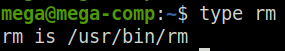

```
$ type cd
```

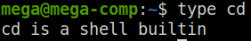

#### Getting help for built-in commands:

```
$ help cd 
OR 
$ cd --help
```

#### Search for a command, function, or keyword in all man pages:

```
$ man -k chmod
```

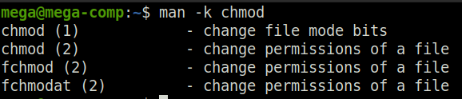

```
$ man -k "copy files"
```

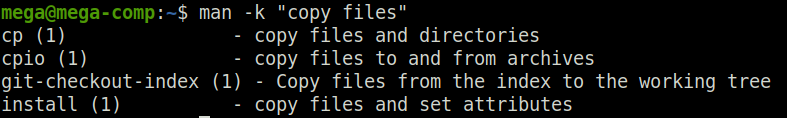

The same as (man -k) == (apropos):

```
$ apropos "copy files"
```

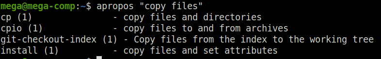

#### Keyboard Shortcuts:


**TAB** - автоматически завершает команду или имя файла, если оно уникально

**TAB TAB (press twice)** - отображает все команды или имена файлов, начинающиеся с этих букв

**ВАЖНО!**
Всегда использовать **TAB** для автокомплита.
Это позволит избежать серьезных проблем. Например. Случайный пробел в пути к файлу приведет к удалению целой директории.

* **CTRL + L или clear** - очистка текущего экрана терминала

* **CTRL + D или exit** - закрыть shell

* **CTRL + U** - удалить текущую строку (УДОБНО – вместо мульти BS)

* **CTRL + A** - переместить курсор в начало текущей строки

* **CTRL + E** - переместить курсор в конец текущей строки

* **CTRL + C** - остановить выполнение текущей команды

* **CTRL + Z** - приостановить выполнение текущей команды

* **Up / Down  arrow** - последние набранные команды


#### History of commands:

История команд пишется для каждого юзера

#### View command history from a file:
(ДЛЯ РЕФРЕША - logout)

```
$ cat .bash_history
```

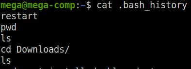

**HISTFILESIZE**  #  переменная == кол-во команд в истории в файле

```
$ echo $HISTFILESIZE
```

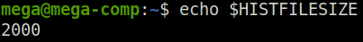

#### View command history from a memory:
(РЕФРЕШ - риалтайм)

```
$ history
```

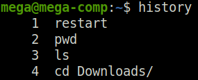

#### Start command from history by number:

```
$ !2
```

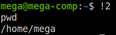

#### Run last command:

```
$ !!
```

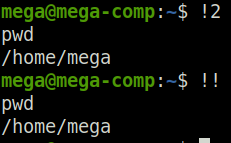

#### Run 3 from the end command:

```
$ !-3
```

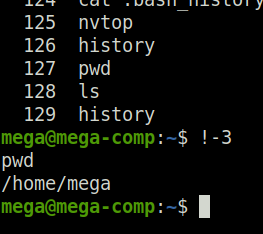

#### Find (last) and execute command in history by keyword:

```
$ !ping
```

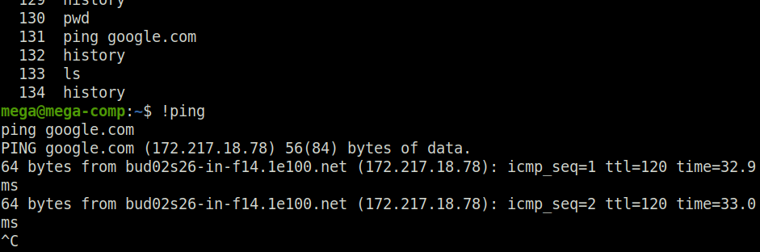

ВНИМАНИЕ!!! Команда выполнится автоматом. Мы не видим ее полностью, ее аргументы …
Чтобы предварительно ее увидеть, распечатать – добавляем -  :p

#### Find (last) and PRINT command in history by keyword:

```
$ !ping:p
```

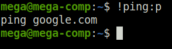

#### SEARCH command in history:

* **CTRL+R** # pi – начинаем набор – сразу видим варианты

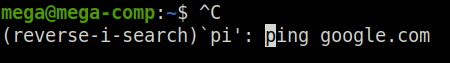

* **ENTER**   # выполнить найденную команду

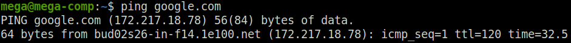

ИЛИ

* **CTRL+G**   # выйти из режима поиска


#### Remove command from history:

```
$ history -d 140
```

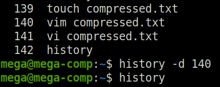

#### Delete all history commands:

```
$ history -c
```

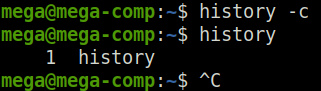

#### Execute a command WITHOUT writing to history:

SPASE + command   #     без history

```
$  who
```

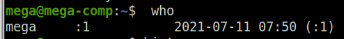

**ВНИМАНИЕ!** В centos по дефолту так не работает

$HISTCONTROL – переменная, отвечающая за это

```
$ echo $HISTCONTROL   #   ubuntu
```

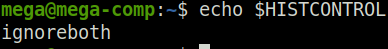

```
$ echo $HISTCONTROL   #   centos
```

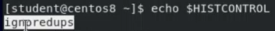

* Переменная $HISTCONTROL   #   имеет 3 значения
* ignorespace  #   history игнорит команды, начинающиеся с пробела
* ignoredups  #   history игнорит команды дубликаты
* ignoreboth  #   history игнорит команды дубликаты + пробелы
* Насетить переменную HISTCONTROL (ТОЛЬКО ТЕКУЩАЯ session)

```
$ HISTCONTROL=ignoredups
```

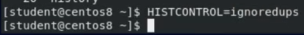

* Сохрарить настройку как постоянную (МЕЖДУ сессиями)

```
$ echo "HISTCONTROL" >> .bashrs
```

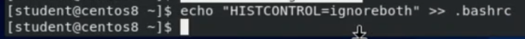

#### History of commands with DATE:

```
$ HISTTIMEFORMAT="%d/%m/%y %T "
```

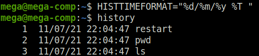

* Save setting as permanent (BETWEEN sessions)

```
$ echo "HISTTIMEFORMAT="%d/%m/%y %T "" >> .bashrc
```

#### Temporarily get – ROOT:
```
$ sudo su
```
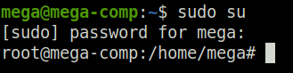

#### Exit ROOT mode:
```
CTRL+d
OR
# exit
```
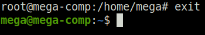
```
$   USER
#   ROOT
```
#### Temporary ROOT mode:
* Выполнить комманду как ROOT, не меняя текущего юзера (кеш – 5 м)
```
$ sudo useradd john
```
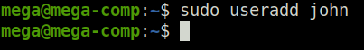

* ВНИМАНИЕ! Sudo кешируется на – 5 мин !!!

* Апдейт кеша sudo снова до 5 мин
```
$ sudo -v
```

* Сброс кеша sudo
```
$ sudo -k
```

#### Set password for ROOT
* Установить пароль для ROOT
```
$ sudo passwd root
```
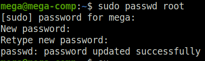

* После установки пароля ROOT – можно юзать короткую форму - su
```
$ su
```
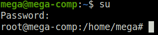
