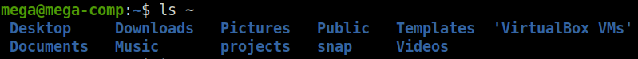
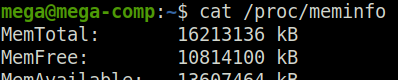
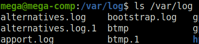

# linux_tutor

***
#### CONTENT:

* [05. The Linux File System](#05-the-linux-file-system)
    * [Absolute vs. Relative Paths. Walking through the File System](#absolute-vs-relative-paths-walking-through-the-file-system)
    * [Navigation](#navigation)
    * [tree](#tree)
    * [The LS Command In Depth (ls)](#the-ls-command-in-depth-ls)


***

# 05. The Linux File System

* В линуксе все является файлом, даже подключаемые устройства

  


`/usr/bin`  здесь хранятся бинарки программ – команд, например
```
$ which ls
```


`/usr/sbin`  здесь хранятся бинарки ADMIN программ, например
```
$ which fdisk
```


`/boot`  содержит файлы необходимые для старта с-мы 

`/home`  домашние дир всех юзеров


```
$ ls /home/mega/
```


```
$ ls ~
```


`/root`  дом дир для ROOT

```
$ ls /root/
```


`/dev`  содержит файлы девайсов, генерятся во время загрузки ОС или даже на лету. Диск партишн тоже файл

```
$ ls -l /dev/sda1
```


`/etc`  дир, где хранятся конфиг файлы (user, password, network, email server, ssh ...)

```
$ ls /etc/ssh
```


`/lib`  дир для общих либ, менеджится пакетным манагером

`/media`  дир для внешних сторов, маунтится автоматом

`/mnt`  legacy дир для внешних сторов, cd-rom, floppy. Здесь можно быстро завмаунтить - partition

`/tmp`  здесь временно хранят файлы запущенные приложения. Юзеры тоже могут хранить свои темпы. Может быть очищена

`/proc`  виртуальная дир – хранит инфо о железе, генерятся во время загрузки ОС или даже на лету

```
$ cat /proc/cpuinfo
```


```
$ cat /proc/meminfo
```


`/sys`  девайсы, драйверы, некоторые фичи ядра

`/srv`  содержит данные для серверов

`/run`  вирт дир – юзается процессами

`/usr`  legacy – дир текущего юзера, содержит реальный bin/sbin

`/var`  сборняк – БД бекапы, логи, вебсайты, темп, все что меняется

```
$ cat /var/log/auth.log
```


#### Absolute vs. Relative Paths. Walking through the File System:

#### Navigation

`.`  текущий дир

`..`  дир уровнем выше - родительский

`~`  хомяк текущего юзера

`$ cd`  перейти в хомяк

`$ cd ~`  перейти в хомяк


`$ cd -`  перейти в предыдущий дир


`$ cd /var/log`  перейти в дир /var/log


`$ pwd`  напечать текущий дир


`$ ls`  содержимое текущей дир

`$ ls /var/log`  содержимое текущей дир – ABSOLUTE PATH



`$ ls`  содержимое текущей дир – RELATIVE PATH


`.file`  скрытый файл (точка вначале)

`$ ls -a`  показывать скрытые файлы (-a)


#### tree

`$ sudo apt install tree`  установить tree

`$ tree`  покажет рекурсивно все, что вложено в текущий дир


`$ tree Pictures/wallpaper/`  tree по заданному пути


`$ tree -d Pictures/`  tree только дир (-d)


`$ tree -df Pictures/`  tree полный путь от текущей дир (-f)


#### The LS Command In Depth (ls)

`$ ls`  содержимое в алфавитном порядке


`$ ls -1`  содержимое в алфавитном порядке в 1 столбик (-1)


`$ ls /etc /var .`  содержимое нескольких дир


`$ ls -l`  long list формат с доп инфо (-l)


`$ ls -ld`  инфо о текущей дир, без содержимого (-d)


`$ ls -l /etc`  доп инфо о файлах


`-rw-r--r--`  файл

`drwxr-xr-x`  дир

`lrwxrwxrwx`  симлинк

